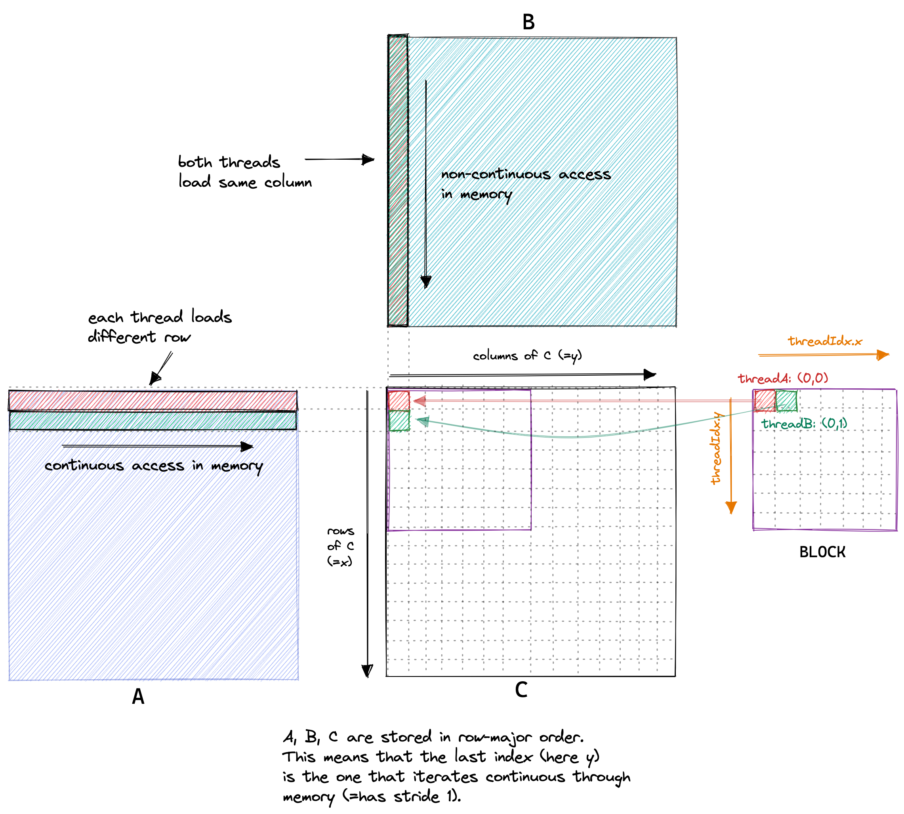

# SGEMM - Single Precision General Matrix Multiplication

SGEMM is the **Single Precision General Matrix Multiplication** routine, one of the most important operations in linear algebra and deep learning. It performs the operation:

**C = α·A·B + β·C**

Where:
- **A**: Matrix of size M×K (single precision floats)
- **B**: Matrix of size K×N (single precision floats)  
- **C**: Matrix of size M×N (single precision floats)
- **α, β**: Scalar coefficients (single precision floats)

## Why SGEMM Matters

1. **Deep Learning Backbone**: ~90% of deep learning computation is matrix multiplication
2. **Performance Critical**: Often the bottleneck in neural network training/inference
3. **Hardware Optimization**: Modern GPUs are specifically designed to excel at SGEMM
4. **BLAS Foundation**: Core routine in Basic Linear Algebra Subprograms (BLAS)

## Mathematical Operation

```
For i = 0 to M-1:
    For j = 0 to N-1:
        sum = 0
        For k = 0 to K-1:
            sum += A[i][k] * B[k][j]
        C[i][j] = α * sum + β * C[i][j]
```


## Performance Challenges

### Memory Access Patterns
- **Cache Efficiency**: Optimizing for L1/L2 cache usage
- **Memory Bandwidth**: Minimizing global memory accesses
- **Coalescing**: Ensuring efficient GPU memory transactions

### Computational Intensity
- **Arithmetic Intensity**: Operations per byte of data accessed
- **Parallelization**: Efficiently utilizing thousands of GPU cores
- **Load Balancing**: Distributing work evenly across compute units

## CUDA Implementation Versions

### v1_naive.cuh - Naive Implementation
Basic CUDA kernel with straightforward parallelization:
- One thread per output element
- Direct global memory access
- No optimizations

### Future Versions (Planned)
- **v2_tiled**: Shared memory tiling for cache optimization
- **v3_vectorized**: Vector load/store instructions
- **v4_tensor_cores**: Utilizing Tensor Cores for mixed precision
- **v5_optimized**: Production-ready optimized version

## Benchmarking Targets

| Version | Performance Goal | Features |
|---------|------------------|----------|
| v1_naive | Baseline | Simple parallelization |
| v2_tiled | 2-5x speedup | Shared memory blocking |
| v3_vectorized | 1.5x additional | Vector instructions |
| v4_tensor_cores | 2-4x additional | Mixed precision, Tensor Cores |
| v5_optimized | cuBLAS competitive | All optimizations |

## References

- [NVIDIA cuBLAS Documentation](https://docs.nvidia.com/cuda/cublas/)
- [CUTLASS: CUDA Templates for Linear Algebra Subroutines](https://github.com/NVIDIA/cutlass)
- [How to Optimize a CUDA Matmul Kernel](https://siboehm.com/articles/22/CUDA-MMM)